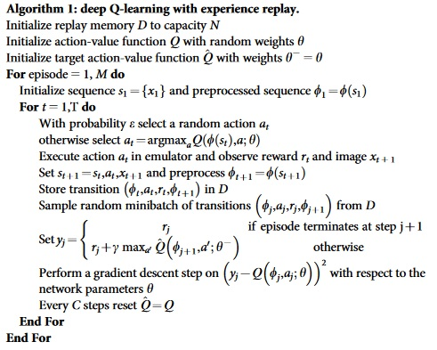
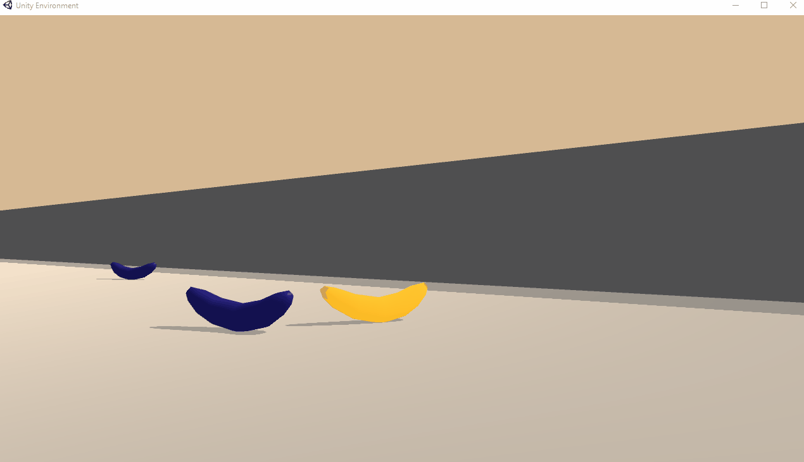

# Udacity DRL Nanodegree - Project 1: Report

### Learning Algorithm :

Deep Q-Network (DQN) algorithm was used to solve the environment.

**References**  

Riedmiller, Martin. "Neural fitted Q iteration–first experiences with a data efficient neural reinforcement learning method." European Conference on Machine Learning. Springer, Berlin, Heidelberg, 2005. http://ml.informatik.uni-freiburg.de/former/_media/publications/rieecml05.pdf  
  
Mnih, Volodymyr, et al. "Human-level control through deep reinforcement learning." Nature518.7540 (2015): 529. http://www.davidqiu.com:8888/research/nature14236.pdf   

In DQN, a neural network is used to represent the action-value function (wich is represented by a table in the original Q-learning algorithm).

Two key features was added to avoid instability problem:  
* Experience Replay: creation of a replay buffer to prevent problems of correlations.
* Fixed Q-Targets: creation of a separate target network.


**DQN Algorithm (from Deepmind paper):**



**Architecture of the Neural Network (model.py):**
  
```
Input layer : state_size (37)  
First hidden layer: fully connected, units=64, activation function: ReLU  
Second hidden layer: fully connected, units=64, activation function: ReLU  
Output layer: action_size (4)  
```

**Hyperparameters (angent_dqn.py):**  

```
BUFFER_SIZE = int(1e5)  # replay buffer size  
BATCH_SIZE = 64         # minibatch size  
GAMMA = 0.99            # discount factor  
TAU = 1e-3              # for soft update of target parameters  
LR = 5e-4               # learning rate   
UPDATE_EVERY = 4        # how often to update the network 
```

### Results

The environment was solved in 434 episodes.  
Plot :  
    

  
Agent navigation :  
    


### Future works

Try the **Learning from Pixels** environment.

**Implement:**  
  
* Prioritized experience replay  
*  Multi-step bootstrap targets  
* Distributational DQN  
* Noisy DQN  

**Try other algorithms:**  
  
* Double DQN  
* Dueling DQN  
* Rainbow  
* C51  
* Agent57  

