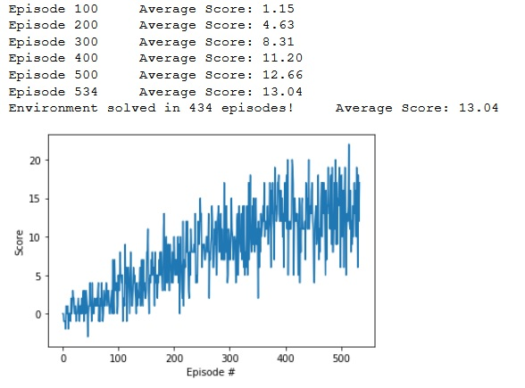

[//]: # (Image References)

[image1]: https://user-images.githubusercontent.com/10624937/42135619-d90f2f28-7d12-11e8-8823-82b970a54d7e.gif "Trained Agent"

# Udacity DRL Nanodegree - Project 1: Report

### Learning Algorithm :

Deep Q-Network (DQN) algorithm was used to solve the environment.  

**DQN Algorithm:**

**Architecture of the Neural Network (model.py):**
  
```Input layer : state_size (37)  
First hidden layer: fully connected, units=64, activation function: ReLU  
Second hidden layer: fully connected, units=64, activation function: ReLU  
Output layer: action_size (4)  
```

**Hyperparameters (angent_dqn.py):**  

```BUFFER_SIZE = int(1e5)  # replay buffer size  
BATCH_SIZE = 64         # minibatch size  
GAMMA = 0.99            # discount factor  
TAU = 1e-3              # for soft update of target parameters  
LR = 5e-4               # learning rate   
UPDATE_EVERY = 4        # how often to update the network 
```

### Results

The environment was solved in 434 episodes.  
Plot :  
    

  
Agent navigation :  


### Discussion and futur improvement

Follow the instructions in `Navigation_DQN_train.ipynb` to train the agent and test it with    


